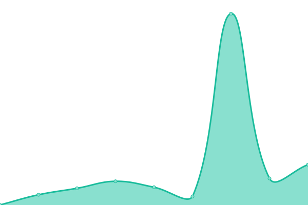
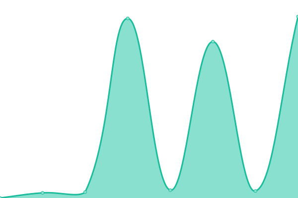

# [📈 Live Status](https://rramiachraf.github.io/dumb-instances): <!--live status--> **🟧 Partial outage**

This repository contains the open-source uptime monitor and status page for [dumb](https://github.com/rramiachraf/dumb) public instances, powered by [Upptime](https://github.com/upptime/upptime).

<!--start: status pages-->
<!-- This summary is generated by Upptime (https://github.com/upptime/upptime) -->
<!-- Do not edit this manually, your changes will be overwritten -->
<!-- prettier-ignore -->
| URL | Status | History | Response Time | Uptime |
| --- | ------ | ------- | ------------- | ------ |
|  [dumb.ducks.party](https://dumb.ducks.party) | 🟩 Up | [dumb-ducks-party.yml](https://github.com/rramiachraf/dumb-instances/commits/HEAD/history/dumb-ducks-party.yml) | 

 471ms
     
 | 

<a href="https://rramiachraf.github.io/dumb-instances/history/dumb-ducks-party">100.00%</a>
    

|  [dumb.privacydev.net](https://dumb.privacydev.net) | 🟩 Up | [dumb-privacydev-net.yml](https://github.com/rramiachraf/dumb-instances/commits/HEAD/history/dumb-privacydev-net.yml) | 

 613ms
     
 | 

<a href="https://rramiachraf.github.io/dumb-instances/history/dumb-privacydev-net">100.00%</a>
    

|  [dumb.hyperreal.coffee](https://dumb.hyperreal.coffee) | 🟩 Up | [dumb-hyperreal-coffee.yml](https://github.com/rramiachraf/dumb-instances/commits/HEAD/history/dumb-hyperreal-coffee.yml) | 

 393ms
     
 | 

<a href="https://rramiachraf.github.io/dumb-instances/history/dumb-hyperreal-coffee">100.00%</a>
    

|  [dm.vern.cc](https://dm.vern.cc) | 🟩 Up | [dm-vern-cc.yml](https://github.com/rramiachraf/dumb-instances/commits/HEAD/history/dm-vern-cc.yml) | 

 276ms
     
 | 

<a href="https://rramiachraf.github.io/dumb-instances/history/dm-vern-cc">93.19%</a>
    

|  [dumb.lunar.icu](https://dumb.lunar.icu) | 🟥 Down | [dumb-lunar-icu.yml](https://github.com/rramiachraf/dumb-instances/commits/HEAD/history/dumb-lunar-icu.yml) | 

 385ms
     
 | 

<a href="https://rramiachraf.github.io/dumb-instances/history/dumb-lunar-icu">95.12%</a>
    

|  [dumb.privacyfucking.rocks](https://dumb.privacyfucking.rocks) | 🟥 Down | [dumb-privacyfucking-rocks.yml](https://github.com/rramiachraf/dumb-instances/commits/HEAD/history/dumb-privacyfucking-rocks.yml) | 

 0ms
     
 | 

<a href="https://rramiachraf.github.io/dumb-instances/history/dumb-privacyfucking-rocks">0.00%</a>
    

|  [sing.whatever.social](https://sing.whatever.social) | 🟥 Down | [sing-whatever-social.yml](https://github.com/rramiachraf/dumb-instances/commits/HEAD/history/sing-whatever-social.yml) | 

 0ms
     
 | 

<a href="https://rramiachraf.github.io/dumb-instances/history/sing-whatever-social">0.00%</a>
    

|  [dumb.bloat.cat](https://dumb.bloat.cat) | 🟩 Up | [dumb-bloat-cat.yml](https://github.com/rramiachraf/dumb-instances/commits/HEAD/history/dumb-bloat-cat.yml) | 

 630ms
     
 | 

<a href="https://rramiachraf.github.io/dumb-instances/history/dumb-bloat-cat">100.00%</a>
    

|  [dumb.gitro.xyz](https://dumb.gitro.xyz) | 🟩 Up | [dumb-gitro-xyz.yml](https://github.com/rramiachraf/dumb-instances/commits/HEAD/history/dumb-gitro-xyz.yml) | 

 378ms
     
 | 

<a href="https://rramiachraf.github.io/dumb-instances/history/dumb-gitro-xyz">97.77%</a>
    

<!--end: status pages-->

## 📄 License

- Powered by: [Upptime](https://github.com/upptime/upptime)
- Code: [MIT](./LICENSE) © [Anand Chowdhary](https://anandchowdhary.com), supported by [Pabio](https://pabio.com)
- Data in the `./history` directory: [Open Database License](https://opendatacommons.org/licenses/odbl/1-0/)
